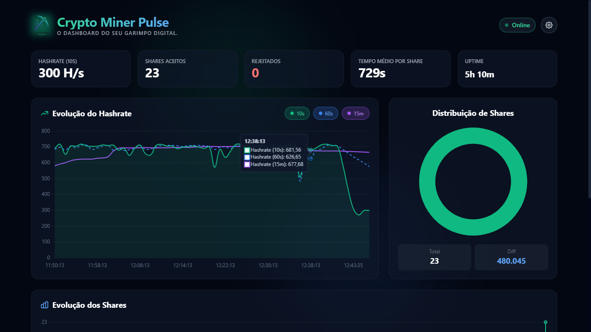

# 🚀 Crypto Miner Pulse

<div align="center">

<p><strong>O dashboard do seu garimpo digital.</strong></p>

</div>

## 💡 Sobre o Projeto

O **Crypto Miner Pulse** é um dashboard de monitoramento em tempo real desenvolvido como um projeto de hobby para mineradores que buscam uma interface visual moderna e intuitiva. Ele funciona como um "espelho visual" para o **XMRig**, transformando os dados técnicos da API HTTP em gráficos e métricas de fácil compreensão.

### 🎯 Propósito e Motivação

A mineração de criptomoedas costuma ser acompanhada por telas de terminal pouco amigáveis. A motivação deste projeto foi criar uma ferramenta que permitisse o monitoramento remoto (via rede local) com uma estética "Gamer/Tech", facilitando a identificação imediata de quedas de desempenho ou problemas de conexão.

---

## 📸 Visual do Dashboard

<div align="center">


</div>

---

## 🛠️ Tecnologias Utilizadas

O projeto foi construído com foco em performance e zero dependências de servidor (Client-side), utilizando:

* **HTML5:** Estruturação semântica de toda a interface e integração de elementos multimídia (ícones e imagens).
* **Tailwind CSS:** Utilizado para criar o layout responsivo e o design "Glassmorphism" através de classes utilitárias, garantindo uma interface moderna e rápida de carregar.
* **JavaScript (ES6+):** O núcleo da aplicação. Gerencia o consumo da API via `fetch`, processa os cálculos de eficiência de *shares* e controla a persistência de dados no navegador.
* **Chart.js:** Responsável pela renderização dos gráficos dinâmicos de linha (evolução do hashrate) e rosca (distribuição de shares aceitos vs. rejeitados).
* **Web Storage API:** Utilizada para salvar suas preferências (URL da API e intervalo de tempo) e o histórico de mineração localmente, para que os dados não sumam ao fechar o navegador.

---

## ✨ Vantagens e Benefícios

* **⚡ Monitoramento Instantâneo:** Acompanhe oscilações de hashrate em janelas de 10s, 60s e 15m.
* **📊 Histórico de Sessão:** Gráficos que mostram a evolução dos *shares* totais e aceitos ao longo do tempo.
* **🔌 Integração XMRig:** Exibição de metadados da estação, como CPU Brand, Algoritmo, Pool e status de *Huge Pages*.
* **📱 Responsividade Total:** Design adaptável para monitorar seu garimpo pelo celular ou desktop.
* **🌐 Sem Instalação:** Basta acessar o link e configurar o IP da sua máquina de mineração.

---

## 🚀 Como Usar

Para começar a monitorar agora mesmo, siga estes passos:

1. **Configure o XMRig:** No seu arquivo `config.json`, certifique-se de que a API HTTP está habilitada:
```json
"http": {
    "enabled": true,
    "host": "0.0.0.0",
    "port": 20100,
    "access-token": null,
    "restricted": false
}

```


*(Dica: Use host `0.0.0.0` para permitir o acesso de outros dispositivos na mesma rede).*
2. **Acesse o Dashboard:** Clique no link abaixo:
👉 **[https://danieldpereira.github.io/crypto-miner-pulse/](https://danieldpereira.github.io/crypto-miner-pulse/)**
3. **Conecte:** Clique no ícone de engrenagem ⚙️ e insira o endereço IP da sua máquina (ex: `http://192.168.1.10:20100/2/summary`).

---

## 📄 Licença

Este projeto é distribuído sob a **Licença MIT**. Para mais detalhes, consulte o arquivo [LICENSE](https://www.google.com/search?q=LICENSE).

---

<div align="center">
<p>Desenvolvido por <a href="https://danieldpereira.github.io/danieldias.py/">Daniel Dias Pereira</a></p>
</div>